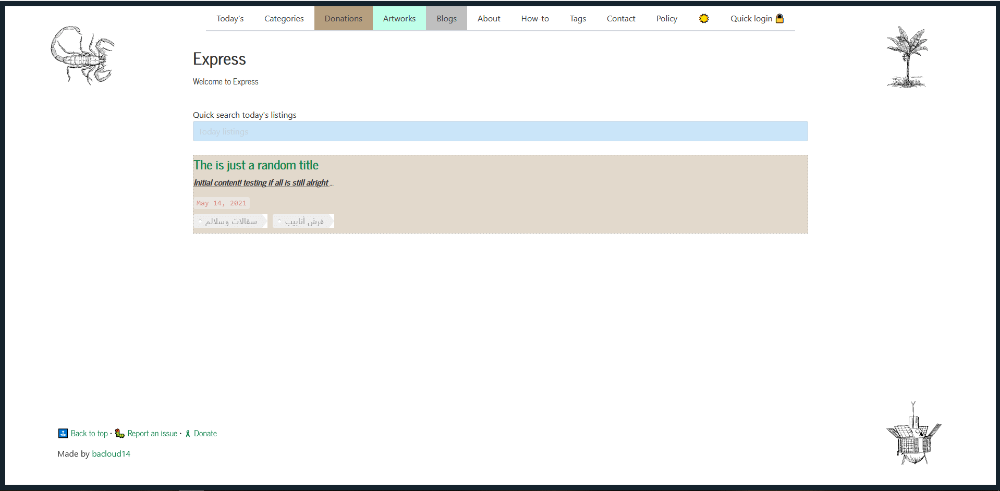
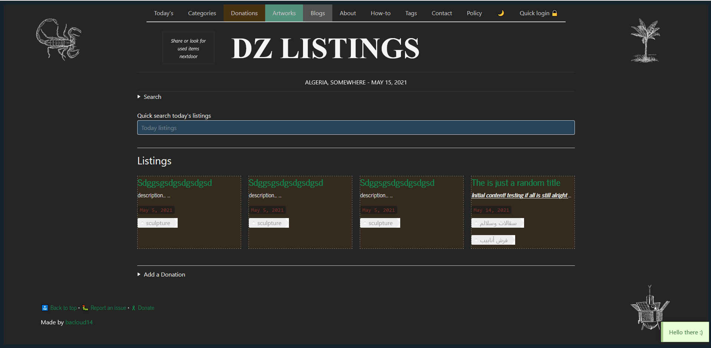
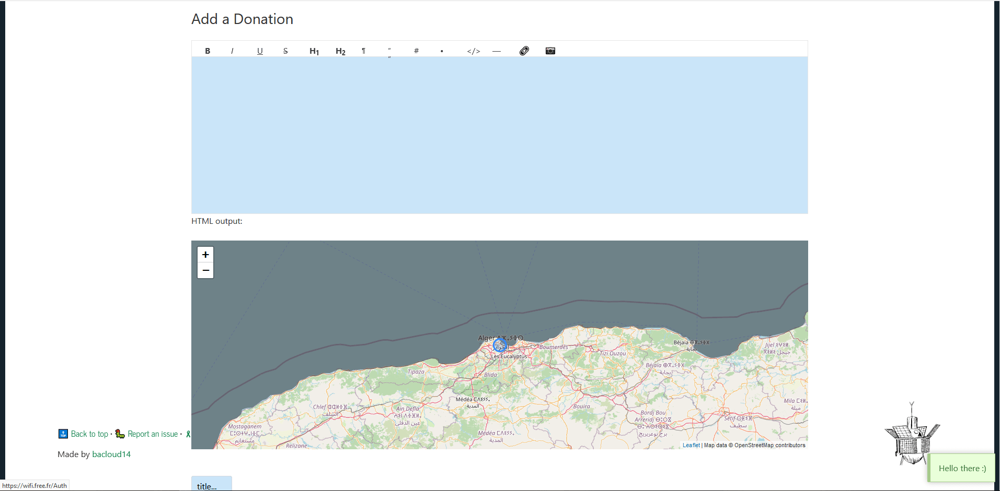
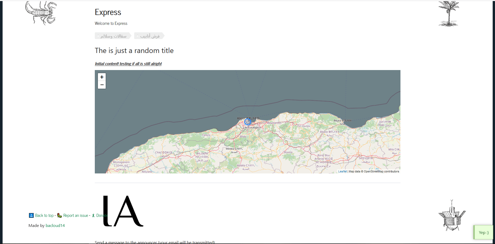

# Listings

When you don't care too much about normalization. Also when you are tired of databases and different driver implementations with their tedious considerations.

You did not ask for all of these. You just wanted to store some megabytes in a file and at the same time query plain JavaScript objects in realtime.

You did not ask for clustering or paralelization neither.

Only then, you can always use a data-structures and a JSON file.

## Considerations

- NodeJS is a single thread program. That means multiple function calls on one global variable (multiple user connections) will definitly not mess things up.
- Watch on the global variable size though, as it lives in memory.

That's it. See how I want to build an listing (announcements, item re-sell...) web app.

Also without authentication: passwordless at least.
Added listings are validated by an admin though.

Take a look as a starting point here:

[helpers simple data API](https://github.com/bacloud14/dz_listings/blob/main/helper_data.js)

[helpers simple functions API](https://github.com/bacloud14/dz_listings/blob/main/helper_data.js)

**With these considerations, this data model is intended to build on in future with a real NoSQL database. It should not be used in production environments as is today.**

## DZ Listings use case

I want to build an open listings/annoucements platform in Algeria (Lack of an online serious listings platform. I feel Facebook and others alone are not that organised and a separate specialized platform can be a good case).

Listings are devided in three main sections:

- Donation platform 
- Minimal blog open for anyone to publish passions, passtimes,hobbies ...
- Digital arts listings

It can succeed or fail based on the above technical considerations (lightweight package --without DB, passwordless ... ).

**This data model is intended to build on in future with a real NoSQL database. It should not be used in production environments as is today.**

### Routes 

Routes reflect what is possible. See https://github.com/bacloud14/dz_listings/blob/main/routes/listings.js 
Otherwise, this is the list of routes (queries and views):

  - localhost:3000/listings -> listings.ejs : is for showing some of items. Also to initiate the following post queries
  - localhost:3000/listings/blablabla -> listings.ejs : is for showing some of items. but for another section (blablabla)
  - localhost:3000/listings/query -> listings.ejs : for exact search of items
  - localhost:3000/listings/queryV2 -> listings.ejs : for fuzzy search items
  - localhost:3000/listings/add -> listing.ejs : for adding an item
  - localhost:3000/listings/deactivate -> messages.ejs : to deactivate an item
  - localhost:3000/listings/{some_id} -> listing.ejs : to show an item of some id
  - localhost:3000/{some_tag} -> listings.ejs : to show all listings including some tag
  - localhost:3000/listings/tags -> tags.ejs : for exposing contant list of possible tags
  - localhost:3000/ exposts all other routes (contact, tags, listings, ...)
  - localhost:3000/contact -> messages.ejs : for user messaging 

## Deployment

- `git clone https://github.com/bacloud14/dz_listings.git`
- `cd dz_listings`
- Create a file called `listings.json` on root. Filled with `{"data":[]}`
- `npm install` then `npm start`
- It cannot be easier.

## Captures

- Index page shows fresh listings

- Section page shows listings of type donations, artworks or blogs

- Add a listing, depending on secrtion type, show or hide map

- Get a listing

## Contribution

For styling and rapid prototyping and to get a feel of the webapp check: https://dzlistings.herokuapp.com/
It's a dev env so no login and no posting is possible.

As always, all my repositories are firstcomers friendly ! 

As I am always learning, please do not hesitate to open any new issue (like better code, readability, modularity and best practice, performance, better UI or even functionality enhancements...).

## License

Dz listings is released under a [CC BY-NC-SA License](https://creativecommons.org/licenses/by-nc-sa/4.0/legalcode).

[Licenses from third parties](https://github.com/bacloud14/dz_listings/blob/main/THIRD%20PARTY%20LICENCES.pdf)

